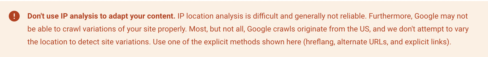
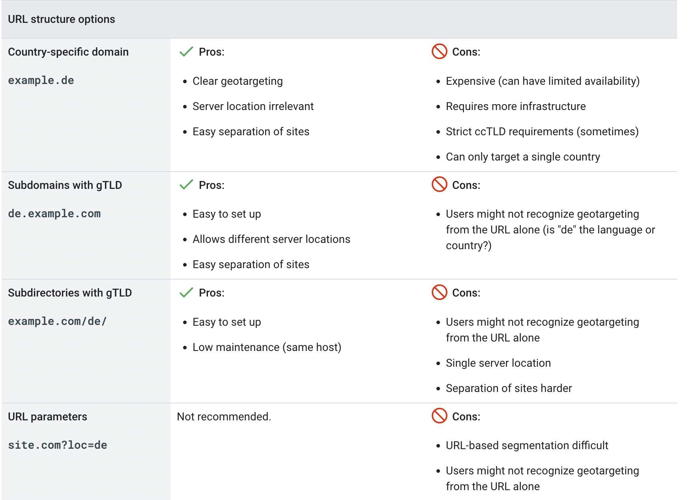
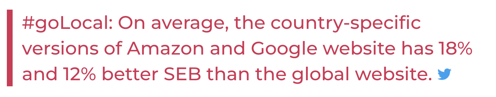
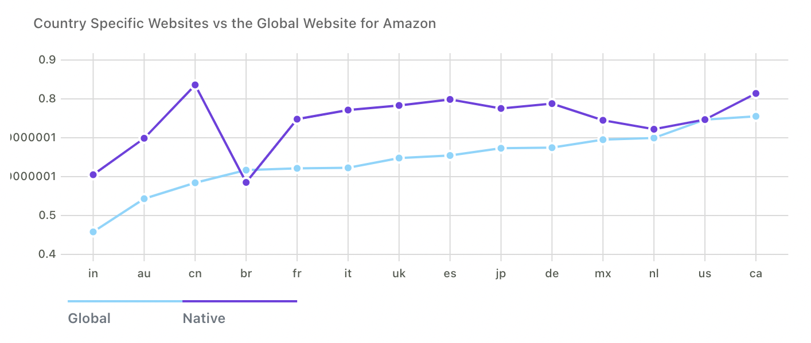
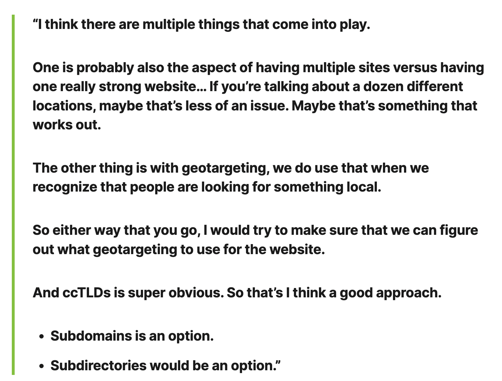

## What's the difference between multilingual and multi-regional?

- A multilingual website is any website that offers content in more than one language. For example, a Canadian business with English and French versions of its site. Google Search tries to find pages that match the language of the searcher.

- A multi-regional website is one that explicitly targets users in different countries. For example, a product manufacturer that ships to both Canada and the United States. Google Search tries to find the right locale page for the searcher.

Some sites are both multi-regional and multilingual: for example, a site might have different versions for the USA and for Canada, and both French and English versions of the Canadian content. Example Amazon.com

## Snippet from google developers:

## Targeting site content to a specific country (geotargeting)

You can target your website or parts of it to users in a single specific country that speaks a specific language. This can improve your page rankings in the target country, but at the expense of results in other locales or languages.

### To geotarget your site on Google:

- Page or site level: Use locale-specific URLs for your site or page.
- Page level: Use hreflang or sitemaps to tell Google which pages apply to which locations or languages.

**NOTE**: Remember that geotargeting isn't an exact science, so it's important to consider users who land on the "wrong" version of your site. One way to do this could be to show links on all pages for users to select their region and/or language of choice.

## Google recommends three different ways for creating locale-specific URLs:

- Country-specific domains: example.ae
- Subdomains: ae.example.com
- Subdirectories: examples.com/ae/

## Using locale-specific URLs

Consider using a URL structure that makes it easy to geotarget your site, or parts of it, to different regions. The following table describes your options:

## Real world examples:

- ccTLD : www.tripadvisor.com.au, www.tripadvisor.co.uk
- Sub-Directory/Sub-Folder : www.ikea.com/us/ , www.ikea.com/it/
- Sub-Domains : spanish.alibaba.com vs german.alibaba.com

Amazon case study:

Source: Google BigQuery

//Add BigQuery Snippet here

## John Mueller Discussing International SEO

## How we want to market:

- If we want to really position these as, we’re the parenting company for UAE, then we kind of want to have our own domain.

- If we want to position it as, we’re a global company and we also do UAE, then having that within existing domain might be okay.

### A ccTLD often promotes consumer trust, therefore engagement will improve.

For example, German consumers can be wary of buying anything non-German. This makes it difficult for companies with a non-German specific presence to compete.

Not only do you have to prove you have better quality than an equivalent German company, you can’t risk diminishing trust signals by not getting a German ccTLD.

Outside of these trust signals, there is the factor of links to consider. German sites considering linking to you from within Germany is a strong preference over links from outside of Germany.”
